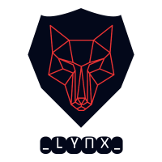

 

 </img>

## SPECIAL THANKS 🙇

➤ [_thelynx001_](https://github.com/thelynx001/) for making the amazing site for this repo!

## LICENSE 

➤ To the extent possible under law, [_thelynx001_](https://github.com/thelynx001/) has waived all copyright and related or neighboring rights to this work.
